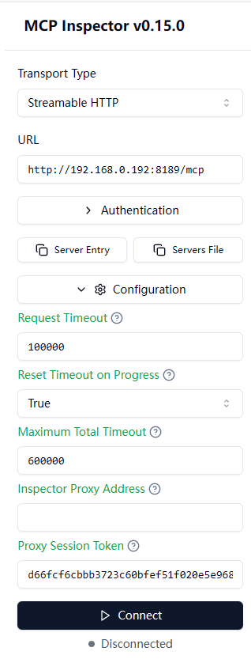
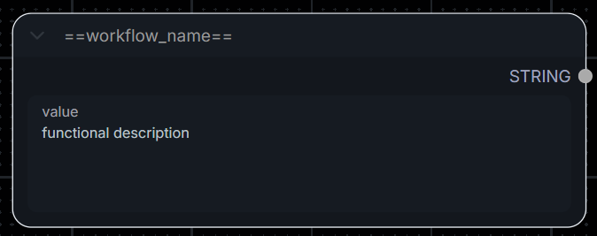
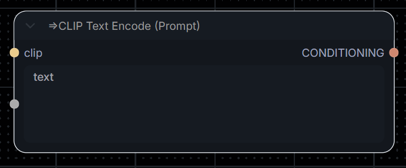

# ComfyUI-MCP-Server - ComfyUI Model Context Protocol Integration

<p align="center">
   [<a href="./README.md">简体中文</a>] 
   [<a href="./README-en.md">ENGLISH</a>] 
</p>

[](./LICENSE)
[](https://www.python.org/)
[](https://modelcontextprotocol.io/)
[](https://github.com/orgs/MetaBrain-Labs)

**ComfyUI-MCP-Server is an MCP (Model Context Protocol) server implementation that transforms user-defined ComfyUI workflows into parameter-configurable MCP tools, directly available to AI Agents.**

> This project provides two independent language editions — **Python** and **TypeScript** — with essentially equivalent features. Choose based on your preference:
>
> [](https://github.com/MetaBrain-Labs/ComfyUI-MCP-Server-Python)
> [](https://github.com/MetaBrain-Labs/ComfyUI-MCP-Server-TypeScript)
>
> Note: The Python edition includes more experimental features; the TypeScript edition is more stable.

## 📋 Project Features

Through this project, you can connect ComfyUI to empower AI assistants (such as `Claude Desktop`, `Trae`, `Dify`, etc.) with powerful multimedia generation capabilities:

| Capability                     | Description                                                                                                                                                            |
| ------------------------------ | ---------------------------------------------------------------------------------------------------------------------------------------------------------------------- |
| **Image / Video Generation**   | Drive AI assistants to generate images, videos, and other media using user-defined workflows; supports AI modifying user-exposed node parameters to fine-tune results. |
| **Custom Workflow Import**     | Manually import ComfyUI API-format JSON files into the server workflow directory; they are automatically validated and mounted for immediate use.                      |
| **Generated Asset Management** | After generation, automatically download and save multimedia files to a specified local directory.                                                                     |
| **Advanced Custom Execution**  | Supports AI providing a complete API JSON directly to dispatch ComfyUI (advanced mode).                                                                                |
| **Asset Upload**               | Upload image/video assets from a local path or HTTP URL to ComfyUI's input directory for direct use in workflows.                                                      |

## ✨ Project Highlights

- 🔌 **Workflow as Tool**: Abstracts ComfyUI node graphs into Agent-ready tools.
- 🎛️ **Custom Parameter Exposure**: Precisely define which parameters are visible in a workflow, restricting AI to operate only within the exposed scope — preventing model hallucinations and mis-operations.
- 🔧 **Zero-Intrusion Integration**: No modifications to ComfyUI itself or any mandatory plugins required — deploy and connect right out of the box.
- 📥 **Custom Workflow Import**: Manually import API-format workflow JSON files; once validated, they are immediately available to the Agent without restarting the service.
- 📂 **Asset Management**: Supports automatically uploading resources to ComfyUI from local paths or network URLs.
- ⚡ **Streaming & Progress Support**: Supports generation progress reporting (requires client/host support).
- 🌍 **Bilingual Internationalization**: Built-in Chinese and English (zh-CN / en) i18n support.
- 🧩 **Standard MCP Compliant**: Fully supports both STDIO and Streamable HTTP transport protocols.
- 🔬 **Skills Support**: Includes a project skills manual `SKILL.md` for deep optimization with AI assistants that support Skills.

For more details, see [Project Advantages](./docs/en/md/Project-Advantages.md)

## 🧰 Available Tools

AI Agents can invoke the following built-in tools via the MCP protocol:

| Tool                    | Tool Name             | Description                                                                                                                                                                                                                                                                     |
| ----------------------- | --------------------- | ------------------------------------------------------------------------------------------------------------------------------------------------------------------------------------------------------------------------------------------------------------------------------- |
| `get_core_manual`       | Get Core Manual       | [System Reference] Core protocol and operation dictionary. Must be read first before initialization or calling other tools to obtain the latest parameter-filling strategies and error recovery mechanisms.                                                                     |
| `get_workflows_catalog` | Get Workflows Catalog | [Catalog Retrieval] Retrieve the list of all workflows supported by the current server. Any image-generation command must precisely match this catalog — fabricating or guessing workflow names is strictly prohibited.                                                         |
| `get_workflow_API`      | Get Workflow API      | [Workflow API] Read the API JSON file of a target workflow. Large in size — call only when diagnosing deep-level logic failures; strictly prohibited in normal operations to avoid context pollution.                                                                           |
| `mount_workflow`        | Mount Workflow        | [Parameter Mount] Extract the supported interactive parameter schema of a target generation task (connection details hidden). Must be called before submitting a workflow task to obtain valid parameter key names.                                                             |
| `queue_prompt`          | Queue Prompt          | [Task Submit] Submit a task Prompt to the queue. Automatically dispatches compute nodes and syncs progress to the host in real time. All key names must pass mount validation — fabricated key names are strictly prohibited.                                                   |
| `queue_custom_prompt`   | Queue Custom Prompt   | [Advanced Mode] Submit a complete native ComfyUI API Prompt JSON directly to the queue. Only available for debugging low-level solutions or responding to explicit expert instructions — strictly prohibited for routine tasks.                                                 |
| `save_custom_workflow`  | Save Custom Workflow  | [Save Workflow] Save a customized parameterized workflow to the server's workflow directory, followed by automatic syntax validation and mounting. The submitted JSON must comply with the spec (must contain at least one `==name==` node), otherwise saving will be rejected. |
| `save_task_assets`      | Save Task Assets      | [Save Generated Assets] Retrieve the execution history for a specified task (`prompt_id`) and download all generated multimedia files (images, videos, GIFs, etc.) to a specified local directory.                                                                              |
| `interrupt_prompt`      | Interrupt Prompt      | [Task Cancel] Cancel the computation process for a specific `prompt_id` and forcibly remove waiting items from the queue.                                                                                                                                                       |
| `get_prompt_result`     | Get Prompt Result     | [Output Snapshot & Assets] Retrieve the node snapshot after a specific Prompt execution, extract the generated target media files (image/video links), or trace back error Tracebacks for diagnostics.                                                                          |
| `get_system_status`     | Get System Status     | [System Monitor] Collect memory, VRAM, and Python runtime metrics to investigate OOM errors or service deadlocks and other low-level anomalies.                                                                                                                                 |
| `list_models`           | List Models           | [Model Directory] Poll the local disk model storage area. When parameters involve specific model files, this tool must be called first to enumerate and verify — fabricating model filenames is strictly prohibited.                                                            |
| `upload_assets`         | Upload Assets         | [Upload Files] Upload local files or network URLs to ComfyUI server's `input` directory for direct use in workflows.                                                                                                                                                            |

## 🎬 Demo

### Default Way

Click the image below to watch the demo video.

<p align="center">
  <a href="https://www.youtube.com/watch?v=MaMiSkvrL64">
    
  </a>
</p>

### API_JSON Way

Click the image below to watch the demo video.

<p align="center">
  <a href="https://www.youtube.com/watch?v=4RpmZb8FpMU">
    
  </a>
</p>

> [!NOTE]
> **Follow this project!**
>
> If you find this project useful or helpful, please give it a `Star ✨`.

## 🚀 Quick Start

Just two steps to get started.

> Reminder: After installing and starting the project, you still need to read the [[Usage Tutorial](#usage)] — otherwise the workflow-related features will not work.

### Prerequisites (Required)

Before starting this project, ensure the following software is installed on your system:

- Python 3.10+ [[Official](https://www.python.org/downloads/)]
- ComfyUI 0.9.1+ [[Official](https://github.com/comfyanonymous/ComfyUI)]
- An MCP Client / AI Agent, e.g. Claude Desktop, Cursor, etc.

---

### Step 1: Install Project & Dependencies

**1. Clone the project**
Run the following command in your terminal:

```bash
git clone https://github.com/MetaBrain-Labs/ComfyUI-MCP-Server-Python.git
```

**2. Navigate to the project directory**

```bash
cd ComfyUI-MCP-Server-Python
```

**3. Install dependencies**

```bash
pip install -e .
# or
pip install -r requirements.txt
```

---

### Step 2: Configure Environment & Start the Project

#### 1. Environment Configuration

Navigate to the project root, copy `.env.example` and rename it to `.env`, then modify it based on your system setup.

```bash
# Copy the configuration file
cp .env.example .env
```

For detailed configuration options, see: [[Environment Variables](#config)]

#### 2. Connect and Run the Project

Choose a transport mode to start the project based on your needs:

> [!TIP]
> **MCP Transport Mechanisms**
>
> The MCP protocol currently defines two standard transport mechanisms for client-server communication:
>
> - STDIO
> - Streamable HTTP
>
> This project supports both. Choose based on your MCP client's capabilities.
>
> You are responsible for ensuring the use of this server complies with applicable terms, laws, regulations, policies, and standards.

**Mode 1: STDIO Connection (Recommended for local clients like Claude Desktop)**

- **MCP Client Startup:**
  Copy the JSON below and paste it into your MCP client's MCP configuration, then modify as needed.
  > [!NOTE]
  >
  > For how to configure an MCP Server in various MCP clients, see: [[Examples](#examples)]
  >
  > For other project settings, modify the environment variables — see [[Environment Variables](#config)] for details.
  >
  > If ComfyUI is running in the cloud, set `"SYNC_MODE"` to `"manual"`
  ```json
  {
    "mcpServers": {
      "comfy-ui-advanced": {
        "command": "python",
        "args": ["-m", "src"],
        "cwd": "<absolute path to project root, e.g. D:/ComfyUI-MCP-Server-Python>",
        "env": {
          "LOCALE": "en",
          "MCP_SERVER_URL": "http://127.0.0.1:8189/mcp",
          "MCP_SERVER_IP": "127.0.0.1",
          "MCP_SERVER_PORT": "8189",
          "COMFY_UI_SERVER_IP": "http://127.0.0.1:8188",
          "COMFY_UI_SERVER_HOST": "127.0.0.1",
          "COMFY_UI_SERVER_PORT": "8188",
          "SYNC_MODE": "timed",
          "SYNC_POLL_INTERVAL_SECONDS": "3",
          "SYNC_EVENT_FALLBACK_INTERVAL_SECONDS": "300",
          "ONDEMAND_REFRESH_COOLDOWN_SECONDS": "3",
          "COMFY_UI_INSTALL_PATH": "",
          "WORKFLOW_NAME_REGEX": "^==(.+?)==$",
          "WORKFLOW_PARAM_REGEX": "^=>(.+)$",
          "LOG_LEVEL": "INFO"
        }
      }
    }
  }
  ```
- **Terminal Startup:**
  ```bash
  # No JSON config needed for terminal mode — run directly from the project root:
  python -m src
  ```

**Mode 2: Streamable HTTP Connection (Recommended for networked / distributed deployments)**

- **MCP Client Startup:**
  Project settings for StreamHTTP are specified in [[.env](./.env.example)] — no JSON configuration is needed.
  > [!NOTE]
  >
  > For how to configure an MCP Server in various MCP clients, see: [[Examples](#examples)]
  >
  > Note: Relatively few MCP Client/Host applications support StreamHTTP — use based on your needs.
  >
  > If ComfyUI is running in the cloud, set `"SYNC_MODE"` to `"manual"` in [[.env](./.env.example)]
  ```json
  {
    "mcpServers": {
      "comfy-ui-advanced-http": {
        "url": "http://127.0.0.1:8189/mcp"
      }
    }
  }
  ```
- **Terminal Startup:**
  ```bash
  # Start Streamable HTTP
  python -m src --transport streamable-http
  # Specify host and port
  python -m src --transport streamable-http --host 0.0.0.0 --port 8189
  ```

The project is now deployed and running. If you need to debug tools, continue reading below — otherwise jump directly to the [[Usage Tutorial](#usage)].

### Debug Tool (MCP Inspector)

Inspector is the official MCP debugging tool. It is recommended to use Streamable HTTP as the connection method for Inspector.

- Clone the project and install dependencies:
  ```bash
  pip install -e .
  ```
- Connect Inspector to the stdio server:
  ```bash
  npx @modelcontextprotocol/inspector python -m src
  ```

After startup, a URL like the following will appear in the console. Copy it into your browser to start debugging tools:

```bash
# MCP_PROXY_AUTH_TOKEN changes every startup — update your link each time
http://localhost:6274/?MCP_PROXY_AUTH_TOKEN=d66fcf6cbbb3723c60bfef51f020e5e96811002a675e7162b065b44f2fe377f3
```

Browser page configuration after Inspector starts:



<a id="usage"></a>

## 📖 Usage Tutorial

This project requires simple specific markers to be added to ComfyUI workflows, enabling AI Agents to accurately identify and invoke them. You can add available workflows via either of the following two methods:

### Marker Rules (Must Read)

Regardless of which method you use to add workflows, the following marker nodes must be added to each workflow:

#### 1. Define Tool Name & Description (Required)

- Create a new `PrimitiveNode` (Primitive Node) or `PrimitiveStringMultiline` (Multiline String Node) — **no connection to any other node is needed**.
- Double-click to rename the node title to `==your-workflow-name==` (e.g., `==text-to-image==`). **Note: This is the tool name the AI Agent will see — it must be unique across the server.**
- In the node's text input box, write a **functional description** of the workflow (e.g., "A basic text-to-image workflow suitable for generating anime-style images"). **The clearer the description, the more accurately the AI can decide when to invoke it.**

> [!TIP]
> **Auto-Filtering:** This project automatically ignores any workflow that does not have a title in the `==Workflow Name==` format, ensuring the AI only operates within the defined safe boundaries — preventing model hallucinations.



#### 2. Expose Adjustable Parameters (Optional)

- If you want the AI to dynamically modify certain node attributes (e.g., positive prompt, image dimensions, random seed), you need to expose those parameters.
- Find the target node (e.g., `CLIP Text Encode (Prompt)` node).
- Double-click to rename its title to `=>parameter description` (e.g., `=>positive prompt` or `=>image width`).
- After saving, the server will automatically parse it as a variable parameter for the MCP tool — the AI can fill in values as needed when invoking the tool.

> [!TIP]
> **Auto-Filtering:** This project automatically ignores all regular node parameters and node connection parameters that do not have a `=>` title prefix, ensuring the AI only operates within the defined safe boundaries — preventing model hallucinations.<br>



---

### Method 1: Save from the ComfyUI Canvas (Recommended)

For users running ComfyUI with the new workflow save mechanism:

1. Organize your nodes in ComfyUI according to the **Marker Rules** above.
2. Click the **Save** button on the ComfyUI panel.
   > It is recommended to click **Queue Prompt (Run)** once after saving to verify the workflow runs correctly.
3. The workflow will be saved to ComfyUI's user data directory (usually `userdata/workflows/`).
4. **When the workflow takes effect depends on your `SYNC_MODE` configuration:**
   - `timed` mode (default): The MCP server polls in the background at regular intervals, automatically discovers newly saved workflows, and mounts them as AI Agent tools immediately after validation passes.
   - `manual` mode: A scan is triggered on demand only when the AI Agent attempts to invoke the tool catalog.
   - `push` mode (experimental): Requires a ComfyUI plugin — enables real-time push-based notification to the server after saving.

### Method 2: Manually Import API-Format JSON Files

For externally imported workflows or directly authored API-format (API Format) workflow files:

1. Prepare your ComfyUI API-format JSON file.
2. Open the JSON file with a text editor and add the following content to comply with the **Marker Rules**:
   - **Tool Name:** Add the following anywhere in the file:

   ```json
    "99": {
      "inputs": {
        "value": "**workflow description**"
      },
      "class_type": "PrimitiveStringMultiline",
      "_meta": {
        "title": "==workflow-name=="
      }
    }
   ```

   > "99" is just an example — use an unoccupied node ID in practice.<br>
   > After adding, verify the JSON format is correct — every node entry must be followed by a comma, otherwise the workflow will fail to load.
   - **Expose Parameters:** For each node whose parameters you want the AI to modify, add or update the `_meta` object with `"title": "=>parameter description"`.

3. Place the modified JSON file directly into the project's `workflow/` directory (create the directory manually if it does not exist).
4. **The activation mechanism is the same as Method 1**, depending on `SYNC_MODE`:
   - `timed` mode (default): The MCP server will periodically scan the directory, automatically parse parameters, and complete the mount.
   - `manual` / `push` mode: The workflow will be loaded on demand the next time the AI Agent requests the workflow catalog or invokes a tool.

> [!NOTE]
>
> **About failed/error tasks appearing in the task queue**
>
> While using this project, you may occasionally see red error boxes or failed tasks in the ComfyUI Queue. This is because the MCP server silently validates the topology and node legality of your workflows in the background via the ComfyUI engine, in order to verify their suitability for AI invocation. **This is completely normal and will not affect your regular image generation or AI operations in any way — feel free to ignore them.**

<a id="config"></a>

## ⚙️ Environment Configuration

> [!TIP]
> **Note**
>
> Some parameters listed below are not yet active — those are reserved for future planned features.
>
> After modifying the configuration file, restart the service for changes to take effect — simply reopen the chat window in your MCP Client/Host.
>
> MCP Client/Host connection configuration takes priority over this config file. To change connection settings, modify them in your MCP Client/Host connection config file.

<details open>
<summary>Click to view the full configuration file reference</summary>

```
# =============================================================================
# ComfyUI MCP Server - Configuration
# Configuration guide:
#   [User Config]   User settings — modify this section for your deployment
#   [System Config] System settings — leave as default, no changes needed
# =============================================================================

# =============================================================================
# [User Config] User Configuration
# Modify this section based on your deployment environment.
# =============================================================================

# Language for MCP tool descriptions.
# Options: en (English) | zh-CN (Chinese)
LOCALE=en

# -----------------------------------------------------------------------------
# ComfyUI Server Connection
# -----------------------------------------------------------------------------

# Full URL of your ComfyUI server. No trailing slash.
COMFY_UI_SERVER_IP="http://192.168.0.171:8188"

# Host (without protocol) and port. Used separately for WebSocket connections.
COMFY_UI_SERVER_HOST="192.168.0.171"
COMFY_UI_SERVER_PORT="8188"

# -----------------------------------------------------------------------------
# Sync Mode
# -----------------------------------------------------------------------------

# Controls how the server detects workflow updates from ComfyUI.
#
#   timed  — Background loop polls ComfyUI at a fixed interval. (default)
#
#   push   — [Experimental] ComfyUI plugin sends real-time save events;
#             long fallback poll acts as a safety net.
#             Requires COMFY_UI_INSTALL_PATH (must be on same machine as ComfyUI).
#
#   manual — No background loop. Refresh only when tools are called
#             (get_workflows_catalog / mount_workflow / queue_prompt).
#
SYNC_MODE=timed

# Polling interval in seconds for timed mode.
SYNC_POLL_INTERVAL_SECONDS=3

# Fallback polling interval in seconds for push mode (safety net for missed events).
SYNC_EVENT_FALLBACK_INTERVAL_SECONDS=300

# Cooldown in seconds between manual mode refreshes.
# Prevents excessive ComfyUI API calls when tools are called in quick succession.
ONDEMAND_REFRESH_COOLDOWN_SECONDS=3

# -----------------------------------------------------------------------------
# Push Mode Plugin (only required when SYNC_MODE=push)
# -----------------------------------------------------------------------------

# Absolute path to your LOCAL ComfyUI installation root directory.
# Required when SYNC_MODE=push: MCP Server will automatically deploy a lightweight
# backend plugin that pushes workflow save events in real-time.
# Leave blank if ComfyUI runs on a remote machine or if using timed/manual mode.
#
# Windows example: COMFY_UI_INSTALL_PATH=C:/ComfyUI
# Linux   example: COMFY_UI_INSTALL_PATH=/home/user/ComfyUI
COMFY_UI_INSTALL_PATH=

# -----------------------------------------------------------------------------
# Workflow Marker Patterns
# -----------------------------------------------------------------------------

# Regex identifying the workflow name node (title of a PrimitiveStringMultiline node).
# Must contain ONE capture group that extracts the MCP tool name.
# Default matches titles like "==my_workflow=="
WORKFLOW_NAME_REGEX=^==(.+?)==$

# Regex identifying configurable parameter nodes.
# Must contain ONE capture group that extracts the parameter description.
# Default matches titles like "=>prompt text"
WORKFLOW_PARAM_REGEX=^=>(.+)$

# =============================================================================
# [System Config] Internal Settings
# Change only if you know what you are doing.
# =============================================================================

# -----------------------------------------------------------------------------
# MCP Server Address
# -----------------------------------------------------------------------------

# MCP server bind address and listening port.
MCP_SERVER_URL="http://192.168.0.192:8189/mcp"
MCP_SERVER_IP="http://192.168.0.192"
MCP_SERVER_PORT="8189"

# -----------------------------------------------------------------------------
# Logging
# -----------------------------------------------------------------------------

# Minimum log level written to stderr.
# DEBUG | INFO | WARNING | ERROR  (default: INFO)
LOG_LEVEL=INFO

# Optional absolute path for a log file.
# When set, logs are written to BOTH stderr and this file.
# Leave blank to disable file logging.
# LOG_FILE=

# Log file rotation size. Default: 10 MB
# LOG_ROTATE=10 MB

# Number of rotated log files to retain. Default: 7
# LOG_RETAIN=7
```

</details>

<a id="examples"></a>

## Examples

### Cluade Desktop

Click the image below to watch the demo video.

<p align="center">
  <a href="https://www.youtube.com/watch?v=xtsD4egnH6Y">
    
  </a>
</p>

### Trae

Click the image below to watch the demo video.

<p align="center">
  <a href="https://www.youtube.com/watch?v=nxP-I8n2VzU">
    
  </a>
</p>

## 🛠️ Troubleshooting

### Common Issues

1. **WebSocket Connection Failure**
   - Ensure ComfyUI is running.
   - Check the WebSocket port configuration in ComfyUI.
   - Verify that `COMFY_UI_SERVER_HOST` and `PORT` in `.env` are correctly configured.
2. **Workflow Execution Failure**
   - Check that the submitted parameter types match the requirements (schema) of the target node.
   - Check the ComfyUI console for errors related to missing custom nodes.
   - View the MCP Server log in your MCP Client/Host for detailed error information.
3. **Session Expired**
   - Default HTTP session timeout is 30 minutes. For very long video renders, extend the `SESSION_TIMEOUT` constant in the code.

## 🔬 Technical Details

### Core Protocols

1. **MCP (Model Context Protocol)**

   [What is the Model Context Protocol (MCP)? - Model Context Protocol](https://modelcontextprotocol.io/docs/getting-started/intro)

2. **JSON-RPC 2.0**

   [JSON-RPC 2.0 Specification](https://www.jsonrpc.org/specification)

3. **WebSocket**

   [The WebSocket API (WebSockets) - Web APIs | MDN](https://developer.mozilla.org/en-US/docs/Web/API/WebSockets_API)

4. **REST API**

   [About the REST API - GitHub Docs](https://docs.github.com/en/rest/about-the-rest-api/about-the-rest-api?apiVersion=2022-11-28)

### Technical Limitations & Security Considerations

- **Dependency**: Strongly dependent on ComfyUI's native API and WebSocket — non-standard ComfyUI format graph imports are not supported.
- **Security**: The current version does not implement strong authentication (Token/Auth). **Do not** expose it to the public internet. Configure HTTPS and additional gateway-level access control in production environments.
- **Resource Consumption**: High-concurrency calls may cause VRAM overflow (OOM) on the ComfyUI host. Limit concurrent request frequency in the AI system prompt.

### **Workflow Validation Accuracy**

This project categorizes workflow validation accuracy into three modes:

- **Via History Task**: Validated based on **completed tasks with a SUCCESS result** in history.
  - This ensures the workflow execution success rate is maintained as long as core components like models are unaffected.
- **Via Initial Workflow Only**: Validated for **workflows with no history, or whose history predates the workflow's latest modification time**.
  - This performs only a preliminary check — verifying connectivity between nodes — but does not guarantee the full workflow will run successfully end-to-end.
  - To improve success rate, consider manually running the workflow. Once a successful history entry is created, subsequent AI invocations will be validated via the history task method.
- **External Import**: **API JSON files provided by the AI or user directly** — no pre-execution validation is performed; no guarantee of full workflow success.
  - All validation is delegated to the ComfyUI backend. If there are issues with the API JSON format, nodes, or parameter ranges, the ComfyUI backend will intercept and return an error.
  - This is a last-resort fallback for when both history-based and initial workflow validation are unavailable.

## 🗺️ Roadmap

> [!TIP]
> **Note**
>
> We are actively expanding the project. If you have ideas or suggestions, feel free to submit an Issue!

- [ ] **Enhanced Workflow Parsing**: Support more complex nested nodes and dynamic parameter extraction.
- [ ] **Cloud Service Integration**: Adapter for mainstream ComfyUI cloud hosting platforms (auth & API mapping).
- [ ] **Connection Optimization**: Improve StreamHTTP reconnection mechanism and session persistence.
- [ ] **Performance Dashboard**: Add visual resource usage and task queue monitoring feedback.
- [ ] **ComfyUI Plugin**: Develop a ComfyUI plugin for seamless integration with the MCP service.

## 🤝 Contributing

Contributions are welcome! Feel free to submit a Pull Request.

### Contribution Guidelines

1. Fork the project
2. Create a feature branch
3. Commit your changes
4. Push to the branch
5. Open a Pull Request

## 📄 License

This project is open-source under the **MIT** License — see the [LICENSE](./LICENSE) file for details.

_This project is a third-party community-driven open-source initiative and is not an official ComfyUI product. Contributed and incubated by [MetaBrain-Labs](https://github.com/MetaBrain-Labs)._

## 📬 Contact

_(Note: Due to work schedules, email replies may be delayed. Please prefer using GitHub Issues.)_

### Issue / Request Submission

[MetaBrain-Labs (metabrain0302@163.com)](mailto:metabrain0302@163.com)

### Contributors

`TypeScript` edition author:

[LaiFQZzr (lfq2376939781@gmail.com)](mailto:lfq2376939781@gmail.com)

[](https://github.com/LaiFQzzr)

`Python` edition author:

[OldDeer (q1498823915@outlook.com)](mailto:q1498823915@outlook.com)

[](https://github.com/OldDeer00)

## Disclaimer

> [!WARNING]
> **Disclaimer**
>
> We currently have **no** official website. Any related websites you find online are unofficial and unaffiliated with this open-source project — please exercise your own judgment.
>
> **We do not offer any paid services. Please monitor your API token usage — any losses incurred are unrelated to this organization.**
